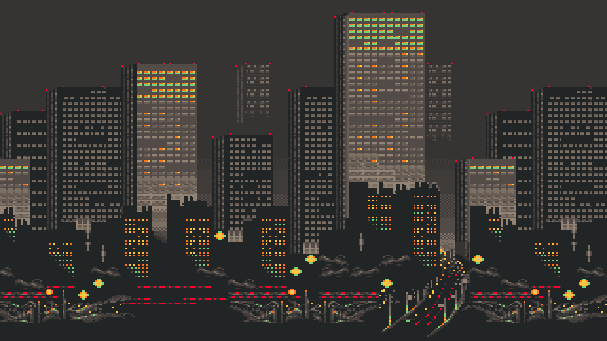
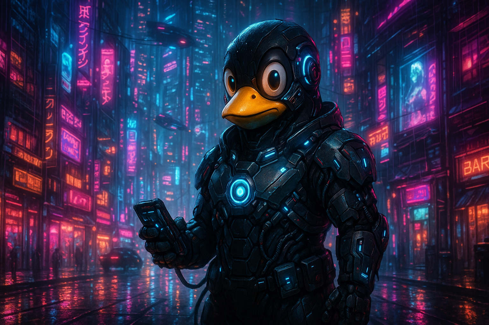
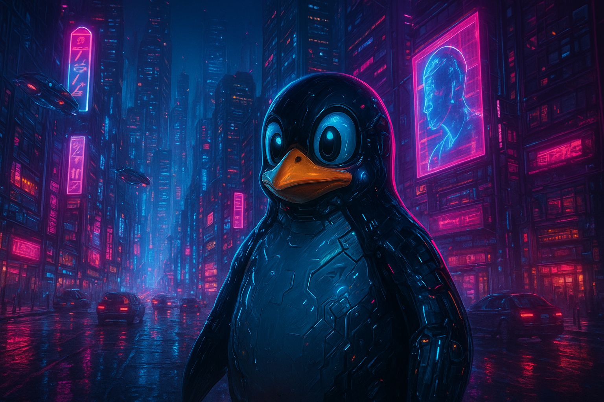

<div align="center">
  <h1>🌿 hyroto</h1>

  Configuración personal de <a href="https://hyprland.org/">Hyprland</a> para Debian 13 Linux.  
  Setup con 3 monitores, animaciones suaves y enfoque en productividad de terminal.
</div>

<div align="center">


</div>

---

## Wallpapers

<div align="center">

| city.png | cybertux.png | tux.png |
|---|---|---|
|  |  |  |

</div>

---

## Setup

| Componente | Herramienta |
|---|---|
| Compositor | Hyprland |
| Terminal | Kitty |
| Launcher | Wofi |
| Bar | Waybar |
| Wallpaper | Hyprpaper |
| File Manager | Thunar |
| Browser | Floorp |
| Screenshots | Flameshot |

---

## Monitores

Setup triple monitor:

```
HDMI-A-1  1920x1080 @ 60Hz   →  izquierda
eDP-1     1920x1080 @ 144Hz  →  centro (laptop)
DP-1      1920x1080 @ 60Hz   →  derecha
```

---

## Keybinds

### Aplicaciones

| Keybind | Acción |
|---|---|
| `SUPER + Return` | Terminal (Kitty) |
| `SUPER + D` | Launcher (Wofi) |
| `SUPER + E` | File manager (Thunar) |
| `SUPER + SHIFT + F` | Browser (Floorp) |
| `CTRL + ALT + S` | Captura de pantalla (Flameshot) |

### Ventanas

| Keybind | Acción |
|---|---|
| `SUPER + W` | Cerrar ventana |
| `SUPER + F` | Fullscreen |
| `SUPER + A` | Fullscreen (sin decoraciones) |
| `SUPER + S / V` | Toggle flotante |
| `SUPER + Q` | Toggle split |
| `SUPER + ←→↑↓` | Mover foco |
| `SUPER + SHIFT + ←→↑↓` | Intercambiar ventanas |
| `SUPER + ALT + ←→↑↓` | Redimensionar (±50px) |
| `SUPER + CTRL + ←→↑↓` | Mover flotante (±20px) |

### Workspaces

| Keybind | Acción |
|---|---|
| `SUPER + 1..0` | Ir a workspace N |
| `SUPER + SHIFT + 1..0` | Mover ventana a workspace N |
| `SUPER + Tab` | Siguiente workspace |
| `SUPER + SHIFT + Tab` | Workspace anterior |
| `SUPER + U` | Toggle scratchpad |
| `SUPER + SHIFT + U` | Mover al scratchpad |

### Sistema

| Keybind | Acción |
|---|---|
| `CTRL + SHIFT + ↑ / ↓` | Volumen +5% / -5% |
| `CTRL + SHIFT + M` | Mute toggle |
| `SUPER + CTRL + ALT + → / ←` | Brillo +5% / -5% |

---

## Look & Feel

```
rounding          10px
gaps_in           4px
gaps_out          8px
border_size       2px
active_border     rgba(33ccffee) → rgba(00ff99ee)  45deg
blur              enabled  (size 3, passes 1)
animations        smoothBezier 0.05, 0.9, 0.1, 1.05
layout            dwindle
```

---

## Instalación

```bash
git clone https://github.com/Rickemtz/hyroto.git
cp hyroto/hyprland.conf  ~/.config/hypr/
cp hyroto/hyprpaper.conf ~/.config/hypr/
cp -r hyroto/img         ~/.config/hypr/
```

> Ajusta la sección `MONITORS` en `hyprland.conf` según tu hardware antes de recargar.

---
